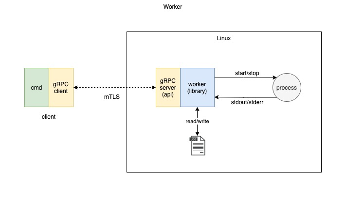

# Job Scheduler

## Summary

Prototype job worker service that provides an API to run arbitrary Linux processes.


## Overview

### Library

*   Worker library with methods to start/stop/query status and get an output of a running job.

### API

*   Use GRPC for API to start/stop/get status of a running process;
*   Add streaming log output of a running job process; 
*   Use mTLS and verify client certificate; 
*   Set up a strong set of cipher suites for TLS and a good crypto setup for certificates;
*   Authentication and Authorization.

### Client	

*   Client command should be able to connect to worker service and schedule several jobs. 
*   The client should be able to query the results of the job execution and fetch the logs. 
*   The client should be able to stream the logs.

## Out of scope

*   Database to persist the worker state;
*   Log rotation, purge data policy, distributed file system;
*   Authorization server;
*   Cluster setup;
*   Configuration files.

## Design Proposal 



## Build

```sh
$ make build
go test -v -timeout 10s -failfast -cover goteleport.com/pkg/worker
=== RUN   TestStartExistingCommand
--- PASS: TestStartExistingCommand (0.00s)
=== RUN   TestStartNotExistingCommand
--- PASS: TestStartNotExistingCommand (0.00s)
=== RUN   TestStopNotExistingProcess
--- PASS: TestStopNotExistingProcess (0.00s)
=== RUN   TestStopExistingProcess
--- PASS: TestStopExistingProcess (0.00s)
=== RUN   TestQueryExistingProcess
--- PASS: TestQueryExistingProcess (2.01s)
=== RUN   TestQueryStoppedProcess
--- PASS: TestQueryStoppedProcess (2.00s)
=== RUN   TestStreamExistingCommand
--- PASS: TestStreamExistingCommand (0.72s)
PASS
coverage: 90.3% of statements
ok      goteleport.com/pkg/worker       5.368s  coverage: 90.3% of statements
```

